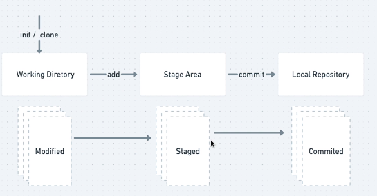

# git

## git log

~~~~bash
git log --oneline # mostra nome cuto dos commits

git log -n 5 # mostra o log dos 5 ultimos commits

git log --since=2020-10-01 # motra os commit desde 2020-10-01

git log --untill=2020-10-01 # mostra commits anteriores 2020-10-01

git log --author=nick # mostra os commits que o author é o nick

git log --grep="init" # faz uma filtragem nos commits onde a mensagem tivero regex "init"
~~~~

## git commit

~~~~bash
git commit -m "meu primeiro commmit" # faz um commmit cuja mensagem é "meu primeiro commit"

git commit --amend -m "modify 1-working-deirectory" # modifica o ultimo commit 
~~~~

## git rm

~~~~bash
git rm --cached file2.txt # remove o arquivo do estado stage
~~~~

## git diff

~~~~bash
git diff 03a9bfb # mostra as diferenças em relação o comit indicado

git diff --staged #mostra a diferença do que está staged
~~~~

## git restore

~~~~bash
git restore --staged README.md # muda o status do arquivo pra untrack

git restore arquivo # restora arqivo para ultimo commit
~~~~

## git mv

~~~~bash
git mv antigo_nome novo_nome # nuda o nome do arquivo
~~~~

## git reset

~~~~bash
git reset HEAd arquivo # reseta o arquivo para o status na head
~~~~

## git checkout

~~~~bash
git checkout maste # vai até a branch master

git checkoout 31431333 -- test # recupera o arquivo test dessa branch
~~~~

## git clean

~~~~bash
git clean -n # mostra os arquivos que irá remover para sempre

git clean -f # força remoção dos arquivos
~~~~

## fluxo do git

